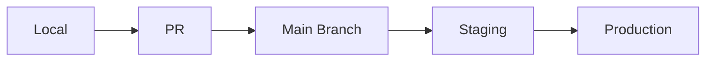

# Deployment Guide

How to ship code safely and confidently to production.

## Deployment Overview

We use continuous deployment with manual approval gates for production.



## Environments

| Environment | URL | Auto-Deploy | Purpose |
|------------|-----|-------------|---------|
| Development | dev.app.com | On PR | Testing features |
| Staging | staging.app.com | On merge to main | Final testing |
| Production | app.com | Manual approval | Live users |

## Deployment Process

### 1. Pre-Deployment Checklist

Before deploying, ensure:
- [ ] All tests passing
- [ ] Code reviewed and approved
- [ ] Database migrations reviewed
- [ ] Feature flags configured
- [ ] Monitoring alerts set up
- [ ] Rollback plan documented

### 2. Deploy to Staging

Automatic on merge to main:
```bash
# Happens automatically via GitHub Actions
# Monitor at: https://github.com/yourcompany/app/actions
```

Manual trigger:
```bash
# Trigger staging deployment
./scripts/deploy.sh staging
```

### 3. Staging Validation

- [ ] Smoke tests pass
- [ ] Key user flows work
- [ ] Performance metrics normal
- [ ] No errors in logs
- [ ] Database queries optimized

### 4. Deploy to Production

#### Option A: GitHub Actions (Recommended)
1. Go to [Actions tab](https://github.com/yourcompany/app/actions)
2. Click "Deploy to Production" workflow
3. Click "Run workflow"
4. Select branch (usually main)
5. Confirm deployment

#### Option B: Command Line
```bash
# Requires production access
./scripts/deploy.sh production --confirm

# With specific version
./scripts/deploy.sh production --version=v1.2.3
```

### 5. Post-Deployment

Immediately after deployment:
1. **Monitor dashboards** (first 5 minutes critical)
2. **Check error rates**
3. **Verify key metrics**
4. **Test critical paths**
5. **Announce in #deployments**

## Rollback Procedure

If something goes wrong:

### Immediate Rollback (< 5 minutes)
```bash
# One-command rollback
./scripts/rollback.sh production

# Or via GitHub Actions
# Actions → Rollback Production → Run workflow
```

### Manual Rollback
1. Identify last working version
2. Deploy specific version:
```bash
./scripts/deploy.sh production --version=<last-good-version>
```

## Database Migrations

### Before Deploying
1. Review migration files
2. Test on staging first
3. Backup production database
4. Plan for rollback

### Running Migrations
```bash
# Automatic with deployment
# Or manual:
kubectl exec -it api-pod -- python manage.py migrate

# Rollback migration
kubectl exec -it api-pod -- python manage.py migrate app_name <previous_migration>
```

## Feature Flags

Use feature flags for risky changes:

```javascript
if (featureFlag('new-feature')) {
  // New code
} else {
  // Old code
}
```

Manage flags at: [flags.internal.com](https://flags.internal.com)

## Monitoring

### Key Dashboards
- [Application Metrics](https://grafana.internal.com/app)
- [Error Tracking](https://sentry.internal.com)
- [Infrastructure](https://datadog.internal.com)
- [User Analytics](https://analytics.internal.com)

### Alert Channels
- **Critical**: PagerDuty → On-call engineer
- **High**: #ops-alerts on Slack
- **Medium**: #engineering on Slack
- **Low**: Daily summary email

## Deployment Schedule

### Regular Deployments
- **Monday-Thursday**: Anytime
- **Friday**: Before 2 PM only
- **Weekends**: Emergency fixes only

### Deployment Freeze
- Major holidays
- Black Friday/Cyber Monday
- Company-wide events
- Announced maintenance windows

## CI/CD Pipeline

Our pipeline stages:
1. **Build** - Compile code, assets
2. **Test** - Unit, integration tests
3. **Security** - Vulnerability scanning
4. **Quality** - Code coverage, linting
5. **Deploy** - Ship to environment
6. **Verify** - Smoke tests

## Troubleshooting

### Build Failing
```bash
# Check logs
gh run view <run-id>

# Re-run specific job
gh run rerun <run-id> --job=<job-id>
```

### Deployment Stuck
```bash
# Check deployment status
kubectl get deployments -n production

# Check pods
kubectl get pods -n production

# View logs
kubectl logs -f deployment/api -n production
```

### Database Issues
```bash
# Check connections
kubectl exec -it api-pod -- python manage.py dbshell

# Check migration status
kubectl exec -it api-pod -- python manage.py showmigrations
```

## Security Notes

- Never commit secrets
- Use environment variables
- Rotate credentials regularly
- Audit production access
- Enable 2FA everywhere

## Getting Help

- **Deployment issues**: #ops-alerts
- **On-call engineer**: PagerDuty
- **Non-urgent**: #engineering
- **Runbooks**: [runbooks.internal.com](https://runbooks.internal.com)

## Deployment Checklist Template

```markdown
## Deployment: [Feature/Fix Name]
- Version: v1.2.3
- Date: YYYY-MM-DD
- Deployer: @username

### Pre-deployment
- [ ] Tests passing
- [ ] Code reviewed
- [ ] Staging tested
- [ ] Rollback plan ready

### Deployment
- [ ] Production deployed
- [ ] Migrations run
- [ ] Feature flags set

### Post-deployment
- [ ] Metrics normal
- [ ] No error spike
- [ ] Key flows tested
- [ ] Team notified
```

Remember: It's better to delay a deployment than to break production! 🚀